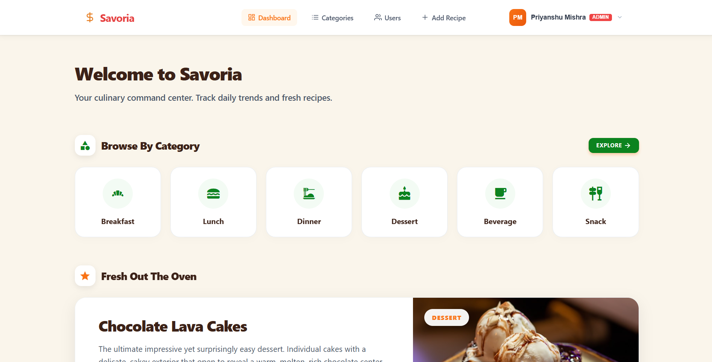
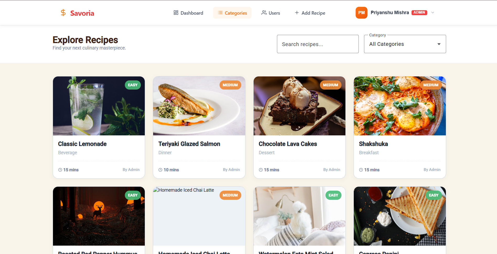
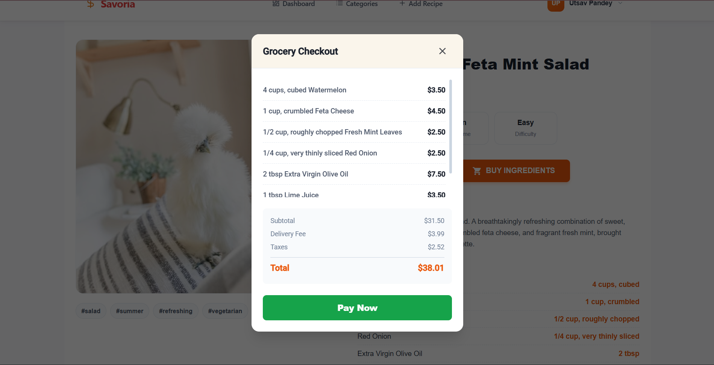
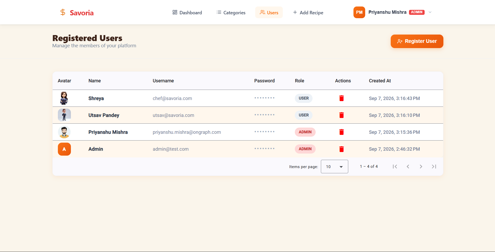

<div align="center">
  
  
  # 🍳 Savoria Recipe App
  
  **A robust, modern Full-Stack Recipe Web Application built with the MEAN Stack.**
  
  [](https://angular.io/)
  [](https://nodejs.org/)
  [](https://expressjs.com/)
  [](https://mongodb.com/)
</div>

---

Savoria focuses on strict REST API design, robust database schemas, secure authentication, role-based access control, and a lightning-fast reactive Angular 17+ standalone frontend.

## ✨ Features

- 🔐 **Secure Authentication**: JWT-based auth with encrypted passwords and 401 handling.
- 🧑‍🍳 **Role-Based Access Control**: Admins can moderate recipes and users.
- 🛒 **Dynamic Checkout**: Mock checkout flow for ingredients with dynamic cart calculations.
- 🔍 **Advanced Search**: Compound text indexes for incredibly fast title, tag, and ingredient searching.
- 📱 **Fully Responsive**: Carefully crafted mobile, tablet, and desktop layouts.

---

## 📂 Folder Structure

The project follows a strict monorepo architecture, separating the Angular frontend and Node.js backend.

### Frontend (`client/`)
```text
client/
├── src/
│   ├── app/
│   │   ├── core/           # Guards, Interceptors, Models, and API Services
│   │   ├── features/       # Smart components (Dashboard, Login, RecipeDetail, etc.)
│   │   ├── shared/         # Reusable UI components & pipes (Navbar, Footer, RecipeCard)
│   │   ├── app.routes.ts   # Application routing configuration
│   │   └── app.ts          # Root component
│   └── environments/       # Environment variables (API URLs)
```

### Backend (`server/`)
```text
server/
├── src/
│   ├── controllers/        # Business logic for routes
│   ├── middleware/         # Custom middleware (JWT protect, Admin role checking)
│   ├── models/             # Mongoose database schemas (User, Recipe)
│   ├── routes/             # Express router definitions
│   ├── scripts/            # Database seeding scripts
│   ├── tests/              # Jest integration test suites
│   ├── validators/         # Express-validator rule chains
│   └── server.ts           # App entry point & express configuration
```

---

## 📸 Screenshots

| Dashboard | Categories |
| :---: | :---: |
|  |  |

| Recipe View | Cooking Mode |
| :---: | :---: |
|  |  |

| Payment Checkout | Add Recipe |
| :---: | :---: |
|  |  |

| My Recipes | Admin Panel |
| :---: | :---: |
|  |  |

| Recipe Scroll | Admin Recipes |
| :---: | :---: |
|  |  |

---

## 📅 Development Progress

### ✅ Day 1: Setup & Data Layer (Completed)
- **Monorepo Architecture**: Clean separation of `client/` (Angular) and `server/` (Node.js/Express) within a single repository.
- **Database Connection**: Configured MongoDB Atlas connection using Mongoose, featuring graceful shutdown hooks (`SIGINT`, `SIGTERM`).
- **Robust Data Modeling**:
  - **User Schema**: Includes `name`, `email`, password hashing (via `bcrypt` pre-save hook), `role` (user/admin), and automatic password omission in JSON responses.
  - **Recipe Schema**: Includes ownership references, validation rules, descriptions, imagery, difficulty, tags, and a likes system.
  - **Search Optimization**: Implemented compound text indexes on recipe titles, ingredients, descriptions, and tags for powerful search queries.

### ✅ Day 2: Authentication (Completed)
- **Authentication Endpoints**: Implemented robust `/api/auth/register` and `/api/auth/login` routes.
- **Security & Hashing**: Verified user credentials securely using `bcrypt` comparison.
- **JWT Implementation**: 
  - Signed JSON Web Tokens upon successful login with a 7-day expiry.
  - Built custom `protect` middleware to intercept requests and verify JWT integrity.
  - Strictly enforcing `401 Unauthorized` for missing, bad, or expired tokens.
- **Session Management**: Implemented `GET /api/auth/me` to safely retrieve the current logged-in user profile from the token payload.

### ✅ Day 3: CRUD, Validation & Authorization (Completed)
- **RESTful Recipe API**: Implemented full CRUD (`GET`, `POST`, `PUT`, `DELETE`) endpoints for recipes.
- **Strict Input Validation**: Utilized `express-validator` to enforce rules on every input field before processing requests.
- **Role-Based Authorization**:
  - Ensured only the original `owner` of a recipe can edit or delete it.
  - Implemented an `admin` role override for global moderation.
- **Status Code Discipline**: Explicit separation between `401 Unauthorized` (auth failure) and `403 Forbidden` (permission failure).
- **Global Error Handling**: Centralized error middleware to catch and format API errors and `404 Not Found` routes consistently.

### ✅ Day 4: API Hardening & Tests (Completed)
- **Advanced Querying**: Implemented pagination, category filtering, and full-text search directly via API query parameters.
- **API Hardening**: 
  - Secured HTTP headers using `helmet`.
  - Configured strict environment-based `CORS` origins.
  - Implemented global endpoint rate-limiting using `express-rate-limit` to prevent abuse.
- **Automated Testing**: Built an integration test suite using `Jest` and `Supertest` covering request validation, authentication tokens, and deep RBAC permission checks.
- **Data Seeding**: Created an automated database seed script for generating test users, admins, and sample recipes.

### ✅ Day 5: Frontend Dashboard & Data Integration (Completed)
- **Standalone Architecture**: Configured Angular routing and feature modules using modern standalone components.
- **Dashboard UI**: Designed the main dashboard layout, featuring dynamic "Fresh Out The Oven" and "Browse by Category" sections.
- **Data Binding**: Integrated backend API endpoints to fetch and display live recipe statistics, categories, and author details.
- **Data Mapping Fixes**: Resolved schema mapping issues between the backend and frontend to accurately calculate and display total cooking/prep times and handle default image fallbacks.

### ✅ Day 6: Responsive Design & Admin Features (Completed)
- **Responsive Navigation**: Implemented a mobile-friendly navbar with a fully functional hamburger menu and tablet-optimized avatars.
- **Admin Users Page**: Revamped the "Registered Users" admin interface to handle varied screen sizes, utilizing horizontally scrollable tables on tablets and stacked headers on mobile.
- **Mobile Grid Layouts**: Refined the "Explore Recipes" page to automatically switch to a sleek single-column grid on small screens, optimizing filter spacing and removing unnecessary padding.
- **UI Standardization**: Adjusted core UI elements like form buttons, border radii, and primary orange gradient actions (`#f97316`) for a highly polished and consistent user experience across devices.

### ✅ Day 7: Bug Fixes, Checkout & Deployment Readiness (Completed)
- **Auth & Routing Fixes**: Resolved critical bugs in the `auth.interceptor.ts` (preventing global logouts on failed logins) and fixed the user registration route that was accidentally locked behind admin middleware.
- **Recipe Link Navigation**: Corrected a regex issue in the URL slug generator that was stripping hyphens and causing 404s, and implemented automatic scroll-to-top logic when navigating between related recipes.
- **Mock Checkout Flow**: Added a "Buy Ingredients" button that launches a beautifully styled, dynamic cart modal which calculates subtotals, delivery fees, and taxes based on the specific recipe's ingredients.
- **Test Suite Enhancements**: Updated backend tests to securely execute against a dedicated `Savoria-Test` database, completely preventing accidental production data deletion during test teardowns.
- **Deployment Configuration**: Added a `start` script for Render compatibility and updated the frontend `set-env.js` file to seamlessly integrate with Vercel's standard environment variables (`process.env.API_URL`).

---

## 🛡️ Authentication & Authorization Walkthrough

Savoria implements strict **Role-Based Access Control (RBAC)** to ensure users can only modify their own data. This is proven and enforced by both the UI and the automated test suite.

**1. Creating a Recipe (Authenticated User)**
When a logged-in user creates a recipe, the backend automatically attaches their unique `User ID` to the recipe's `owner` field via the JWT payload.

**2. Editing/Deleting (Owner)**
If the original author clicks "Edit" or "Delete", the backend verifies that `recipe.owner === req.user.id`. Since they match, the action is permitted (`200 OK`).

**3. The 403 Forbidden Guard (Different User)**
If User B attempts to send a `PUT` or `DELETE` request to User A's recipe, the backend intercepts it:
```typescript
if (recipe.owner.toString() !== req.user.id && req.user.role !== 'admin') {
  return res.status(403).json({ message: 'Forbidden' });
}
```
The server immediately rejects the request with a `403 Forbidden` status. The frontend intercepts this error and displays an access denied message without crashing.

**4. The Admin Override**
If an `admin` attempts to delete User A's recipe, the same block of code sees `req.user.role === 'admin'` and allows the deletion to proceed.

*Note: All of these scenarios are fully covered by the automated integration tests (`npm run test` in the server).*

---

## 🚀 Getting Started

### Prerequisites
- Node.js (v20+)
- Angular CLI (`npm i -g @angular/cli`)
- MongoDB Atlas URI

### Running the Server
```bash
cd server
npm install
npm run dev
```

### Running the Client
```bash
cd client
npm install
npm start
```
