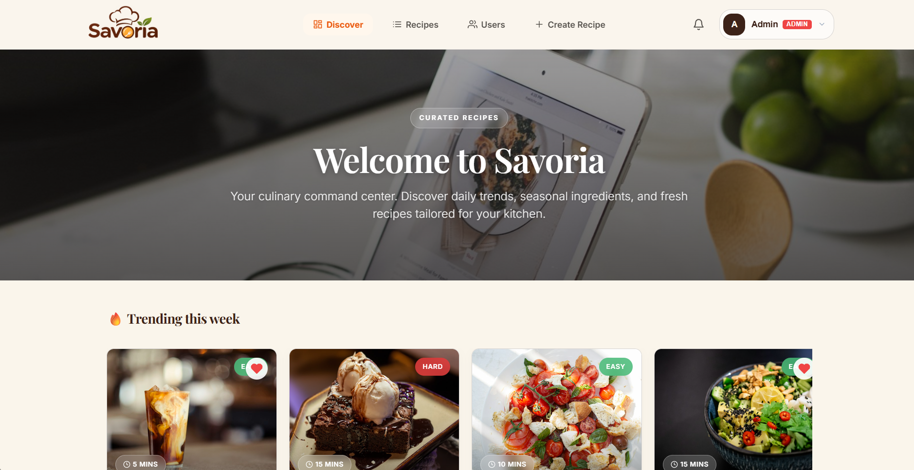
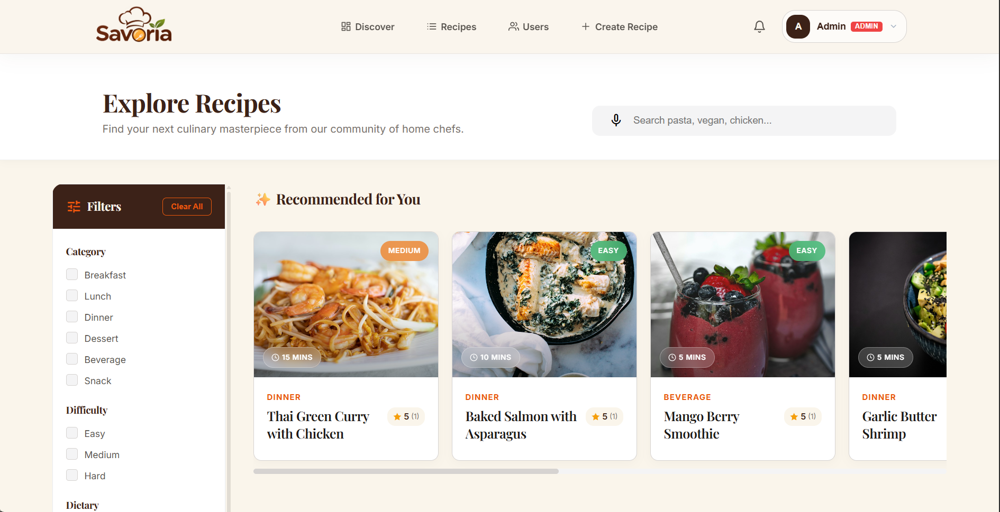
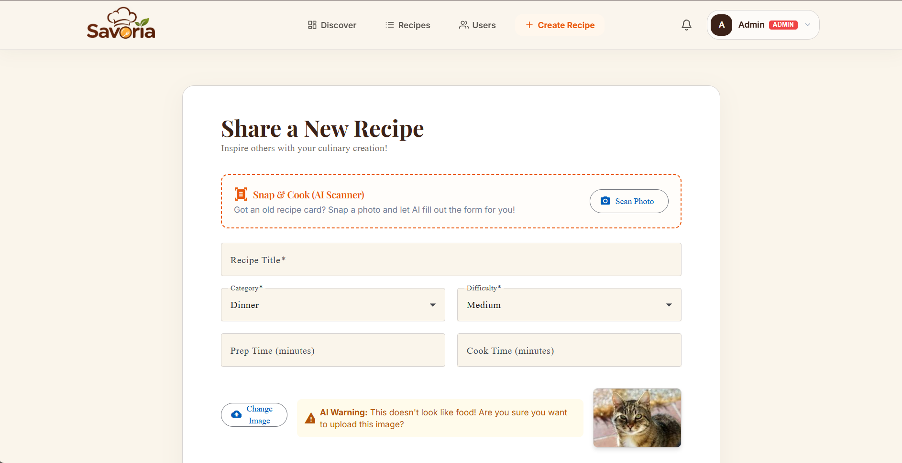
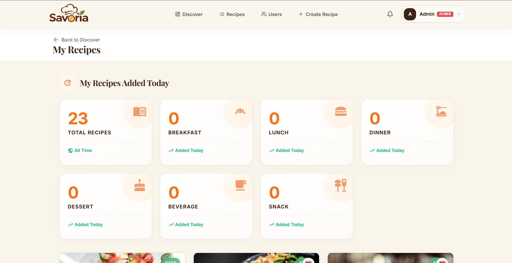
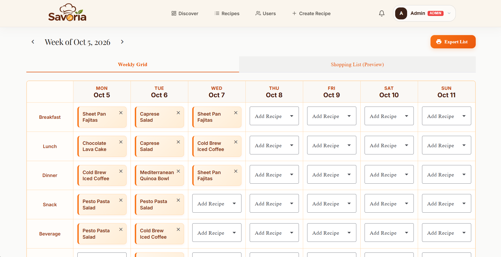

<div align="center">
  
  
  # 🍳 Savoria Recipe App
  
  **A robust, modern Full-Stack Recipe Web Application built with the MEAN Stack.**
  
  [](https://angular.io/)
  [](https://nodejs.org/)
  [](https://expressjs.com/)
  [](https://mongodb.com/)
  [](https://socket.io/)
  [](https://typescriptlang.org/)
  [](https://github.com/priyanshumishra-ongraph/Savoria/actions)
</div>

---

**🔗 Live App**: [savoria-p.vercel.app](https://savoria-p.vercel.app)  
**🔗 Live API**: [savoria-xmme.onrender.com](https://savoria-xmme.onrender.com)  
**🎬 Demo Video**: [Watch on YouTube at 1.5x](https://youtu.be/R8C74GH6p3M?si=pw5VznCPmfGaDmLR)

Savoria is a feature-rich recipe platform built on strict REST API design, robust MongoDB schemas, secure JWT authentication, role-based access control, and a lightning-fast reactive **Angular 21 standalone** frontend with Server-Side Rendering (SSR). It ships with 6 in-browser AI models running entirely via Web Workers — no external AI API costs, no privacy leaks.

## 🔑 Demo Logins

| Role | Email | Password |
| :--- | :--- | :--- |
| **Admin** | admin@savoria.com | admin123 |
| **User** | chef@savoria.com | password123 |

## ✨ Features

### 🔐 Auth & Security
- **JWT Authentication**: Signed tokens with 7-day expiry, `bcrypt` password hashing, and strict `401`/`403` separation.
- **Role-Based Access Control (RBAC)**: `user` and `admin` roles enforced on both frontend guards and backend middleware.
- **Secure HTTP**: `helmet` headers, environment-scoped CORS, and `express-rate-limit` abuse protection.

### 🧑‍🍳 Recipes
- **Full CRUD**: Create, read, update, and delete recipes with image upload via Cloudinary.
- **SEO-Friendly Slugs**: Auto-generated `category/title-slug` URL routing (e.g., `/recipes/dinner/creamy-garlic-pasta`).
- **Compound Text Search**: Weighted MongoDB text indexes across titles (×10), tags (×5), ingredients (×3), steps (×2), and descriptions (×1).
- **Advanced Filtering**: Filter by category, cook time, ingredients, difficulty, and sort by rating, date, or popularity.
- **Cooking Mode**: Hands-free step-by-step view with built-in `window.speechSynthesis` text-to-speech narration.
- **Snap & Cook (OCR)**: Upload a photo of a physical recipe card — `Tesseract.js` WebAssembly transcribes it and auto-fills the recipe form in-browser.

### ⭐ Ratings & Reviews
- **Star Ratings**: 1–5 star system with live `$facet` aggregation keeping `averageRating`, `reviewCount`, and full 5-star distribution in sync.
- **Helpful Voting & Replies**: Vote reviews as helpful; recipe authors can post official replies.
- **AI Sentiment Analysis**: `Xenova/distilbert-base-uncased-finetuned-sst-2-english` via Transformers.js tags each review as POSITIVE/NEGATIVE before submission.
- **AI Toxicity Detection**: `@tensorflow-models/toxicity` scans for insults and profanity, attaching a probability score to every review.

### 📚 Collections & Favorites
- **My Cookbooks**: Create and manage personal recipe collections with pagination.
- **1-Click Favorites**: Heart button on recipe cards auto-provisions a synced "Favorites" Cookbook.
- **Save to Collection Modal**: Save any recipe to one or multiple named cookbooks.
- **Shared Collections**: Token-based public sharing links for collections.
- **AI Image Warning**: `@tensorflow-models/mobilenet` classifies uploaded images in-browser — warns if the image is not food-related.

### 🔔 Real-time Notifications
- **Socket.IO Push**: Live notifications across 4 event types — new Reviews, Saves, Author Replies, and Helpful Votes.
- **JWT-authenticated Sockets**: Every WebSocket connection is verified with the same JWT middleware as the REST API.
- **Anti-Spam Grouping**: Backend groups unread notifications per recipe ("John and 4 others saved your recipe").
- **Rich Dropdown UI**: Unread/All tabs, recipe thumbnails, "Mark all read", inline delete, and cursor-based infinite scroll.
- **Notification Preferences**: Per-user opt-out of any notification type, synced to MongoDB profile.

### 🔍 Search & Discovery
- **Semantic Recommendations**: `Xenova/all-MiniLM-L6-v2` runs cosine similarity in a Web Worker to re-rank "Similar Recipes" by semantic meaning.
- **Voice Search**: Web Speech API integration — speak a query and it auto-fills the search bar.
- **Trending Section**: Horizontal scroll of top-rated, high-engagement recipes.
- **"Cook with what I have"**: Interactive ingredient chip picker, cook-time range slider, and multi-sort bars.
- **RxJS Debounce Pipeline**: `BehaviorSubject` + `switchMap` eliminates duplicate API calls on fast typing.

### 📅 Meal Planner & Shopping
- **Weekly Grid**: Schedule Breakfast, Lunch, Dinner, Snacks, etc. for every day of the week using Angular Material.
- **Smart Shopping List**: Aggregates and merges all ingredients across the week's plan, normalizing units and quantities.
- **Intelligent Ingredient Parser**: Zero-dependency heuristic parser handles complex strings like `1 (15 oz) can` and `1-2 lbs`.
- **Brand-Styled PDF Export**: Print-ready view with hidden browser chrome, forced color printing, and Savoria branding.

### 🛒 Checkout
- **Buy Ingredients Modal**: Dynamic cart calculating per-ingredient subtotals, delivery fee, and taxes for any recipe.

### 🛠️ Admin Panel
- **User Management**: View all registered users, activate or deactivate accounts.
- **Admin Registration**: Dedicated `/admin/register` route for provisioning new admin accounts.
- **Recipe Moderation**: Admins can edit or delete any recipe regardless of ownership.

### 🤖 CI/CD & Testing
- **GitHub Actions**: Automated pipeline on every push — builds Angular, runs Jest + Supertest against an in-memory MongoDB container.
- **53 Integration Tests**: Full coverage of auth, RBAC, pagination, reviews, favorites, collections, and notifications.
- **Angular Unit Tests**: `TestBed` specs for Meal Planner, AuthService, CollectionService, SpeechService, and more.

---

## 🧰 Tech Stack

### Frontend (`client/`)
| Category | Technology |
| :--- | :--- |
| Framework | Angular 21 (Standalone Components + SSR) |
| UI Library | Angular Material 21, Angular CDK |
| Icons | Lucide Angular |
| Styling | SCSS (component-scoped) |
| Reactive | RxJS 7.8 |
| Real-time | Socket.IO Client 4.8 |
| Date Utilities | date-fns 4 |
| In-browser AI | TensorFlow.js 4, `@xenova/transformers` 2, Tesseract.js 7 |
| AI Models | MobileNet, Toxicity, DistilBERT SST-2, all-MiniLM-L6-v2 |
| Build Tool | Angular CLI 21 / `@angular/build` |
| Testing | Vitest 4, jsdom |

### Backend (`server/`)
| Category | Technology |
| :--- | :--- |
| Runtime | Node.js 20+ |
| Framework | Express 5 |
| Language | TypeScript 5.9 |
| Database | MongoDB (Mongoose 8) |
| Auth | JSON Web Tokens (`jsonwebtoken`), `bcryptjs` |
| Real-time | Socket.IO 4.8 |
| File Upload | Multer 2 + Cloudinary |
| Security | `helmet`, `express-rate-limit`, `cors` |
| Validation | `express-validator` 7 |
| Testing | Jest 30, Supertest 7, `mongodb-memory-server` 11 |
| Dev Tools | `tsx` watch, `nodemon` |

### Infrastructure
| Service | Purpose |
| :--- | :--- |
| Vercel | Angular SSR frontend hosting |
| Render | Node.js API hosting |
| MongoDB Atlas | Cloud database |
| Cloudinary | Image storage & delivery |
| GitHub Actions | CI/CD pipeline |

---

## 📂 Code Structure

### Frontend (`client/`)
```text
client/
├── src/
│   ├── app/
│   │   ├── core/
│   │   │   ├── guards/
│   │   │   │   ├── auth.guard.ts         # Protects authenticated routes
│   │   │   │   ├── admin.guard.ts        # Restricts admin-only routes
│   │   │   │   └── guest.guard.ts        # Redirects logged-in users away from login/register
│   │   │   ├── interceptors/
│   │   │   │   └── auth.interceptor.ts   # Attaches JWT Bearer token to every HTTP request
│   │   │   ├── models/
│   │   │   │   ├── types.ts              # Shared TypeScript interfaces (Recipe, User, Review, etc.)
│   │   │   │   ├── meal-plan.ts          # MealPlan & MealSlot types
│   │   │   │   └── notification.ts       # Notification payload types
│   │   │   ├── services/
│   │   │   │   ├── auth.service.ts       # Login, register, token storage, current user signal
│   │   │   │   ├── recipe.service.ts     # Full recipe CRUD + search/filter API calls
│   │   │   │   ├── review.service.ts     # Ratings, helpful votes, replies
│   │   │   │   ├── collection.service.ts # Cookbooks CRUD + sharing
│   │   │   │   ├── favorite.service.ts   # Heart/unfavorite toggle
│   │   │   │   ├── notification.service.ts # Socket.IO + REST notification management
│   │   │   │   ├── search.service.ts     # RxJS BehaviorSubject search pipeline
│   │   │   │   ├── meal-planner.service.ts # Weekly plan state management
│   │   │   │   ├── embedding.service.ts  # Cosine similarity via Web Worker bridge
│   │   │   │   ├── speech.service.ts     # window.speechSynthesis TTS wrapper
│   │   │   │   ├── voice-search.service.ts # Web Speech API voice input
│   │   │   │   └── newsletter.service.ts
│   │   │   └── workers/
│   │   │       ├── sentiment.worker.ts   # Transformers.js DistilBERT + TF.js Toxicity
│   │   │       └── embedding.worker.ts   # all-MiniLM-L6-v2 semantic similarity
│   │   ├── features/
│   │   │   ├── dashboard.component.ts         # Discover page (hero, fresh recipes, categories)
│   │   │   ├── recipe-list.component.ts       # Explore all recipes (search, filter, paginate)
│   │   │   ├── recipe-detail.component.ts     # Single recipe view + cooking mode + checkout
│   │   │   ├── recipe-form.component.ts       # Create/edit recipe form + OCR Snap & Cook
│   │   │   ├── my-recipes.component.ts        # Authenticated user's own recipes
│   │   │   ├── category-recipes.component.ts  # Recipes filtered by category
│   │   │   ├── review-section.component.ts    # Ratings, reviews, AI badges, replies
│   │   │   ├── collections-dashboard.component.ts # My Cookbooks overview
│   │   │   ├── collection-detail.component.ts # Single cookbook detail + sharing
│   │   │   ├── meal-planner.component.ts      # Weekly grid + smart shopping list + PDF export
│   │   │   ├── settings.component.ts          # Notification preferences
│   │   │   ├── users.component.ts             # Admin: user management table
│   │   │   ├── user-registration.component.ts # Admin: register new users
│   │   │   ├── login.component.ts
│   │   │   ├── register.component.ts
│   │   │   └── not-found.component.ts
│   │   ├── shared/
│   │   │   ├── components/
│   │   │   │   ├── recipe-card.component.ts          # Recipe card with rating, heart, save
│   │   │   │   ├── trending-section.component.ts     # Horizontal trending scroll
│   │   │   │   ├── recommended-section.component.ts  # AI-re-ranked recommendations
│   │   │   │   ├── similar-recipes.component.ts      # Semantic similar recipe panel
│   │   │   │   ├── voice-search-btn.component.ts     # Microphone button for voice search
│   │   │   │   ├── filter-chips.component.ts         # Ingredient chip picker
│   │   │   │   ├── sort-bar.component.ts             # Multi-criteria sort bar
│   │   │   │   ├── save-to-collection-modal.component.ts
│   │   │   │   ├── confirmation-modal.component.ts
│   │   │   │   ├── login-prompt-modal.component.ts
│   │   │   │   ├── loading-spinner.component.ts
│   │   │   │   ├── footer.component.ts
│   │   │   │   └── navbar.component.ts (in features/)
│   │   │   └── pipes/
│   │   │       ├── relative-time.pipe.ts   # "3 minutes ago" formatting
│   │   │       └── time-format.pipe.ts     # Minutes → "1h 30m" formatting
│   │   ├── app.routes.ts     # Lazy-loaded standalone route definitions
│   │   ├── app.config.ts     # Root providers (HttpClient, Router, Material)
│   │   └── app.ts            # Root component
│   ├── environments/
│   │   └── environment.ts    # API base URL
│   └── index.html
```

### Backend (`server/`)
```text
server/
├── src/
│   ├── config/
│   │   └── db.ts                      # Mongoose connection + graceful SIGINT/SIGTERM shutdown
│   ├── controllers/
│   │   ├── auth.controller.ts         # Register, login, /me
│   │   ├── recipe.controller.ts       # CRUD, trending, similar, recommended, my recipes
│   │   ├── review.controller.ts       # Create/delete review, helpful vote, author reply
│   │   ├── collection.controller.ts   # Cookbook CRUD, add/remove recipes, sharing tokens
│   │   ├── favorite.controller.ts     # Toggle favorite, auto-sync Favorites cookbook
│   │   ├── notification.controller.ts # Fetch, read, delete, unread count, preferences
│   │   ├── dashboard.controller.ts    # Aggregated discover stats
│   │   └── newsletter.controller.ts
│   ├── middleware/
│   │   ├── auth.middleware.ts         # JWT protect + optionalAuth + admin role check
│   │   └── error.middleware.ts        # Global 404 + error formatter
│   ├── models/
│   │   ├── User.ts         # name, email, bcrypt password, role, avatarUrl, isActive,
│   │   │                   # favorites[], notificationPreferences{}
│   │   ├── Recipe.ts       # title, slug, category, ingredients[], steps[], tags[],
│   │   │                   # averageRating, reviewCount, ratingDistribution{1-5},
│   │   │                   # weighted compound text index
│   │   ├── Review.ts       # rating, comment, sentiment, toxicity, helpfulVotes[], reply{}
│   │   ├── Collection.ts   # name, owner, recipes[], collaborators[], shareToken
│   │   ├── Notification.ts # type, recipient, actor, recipe, groupCount, isRead
│   │   └── newsletter.model.ts
│   ├── routes/
│   │   ├── auth.routes.ts
│   │   ├── recipe.routes.ts       # GET /, /trending, /recommended, /my, /:id, /by-slug/:cat/:slug
│   │   ├── review.routes.ts
│   │   ├── collection.routes.ts
│   │   ├── favorite.routes.ts
│   │   ├── notification.routes.ts
│   │   ├── dashboard.routes.ts
│   │   ├── upload.routes.ts       # Multer + Cloudinary file handling
│   │   └── newsletter.routes.ts
│   ├── scripts/
│   │   ├── seed.ts                # Populates test users, admins, and sample recipes
│   │   └── migrate-slugs.ts       # One-off slug backfill migration
│   ├── socket/
│   │   └── socket.ts              # Socket.IO init, JWT middleware, userSockets Map, emitToUser()
│   ├── tests/
│   │   └── api.test.ts            # 53 Jest + Supertest integration tests
│   ├── utils/
│   │   └── notification.util.ts   # Grouping logic: upsert or increment groupCount
│   ├── validators/
│   │   ├── auth.validator.ts      # express-validator rules for register/login
│   │   └── recipe.validator.ts    # express-validator rules for recipe fields + query params
│   └── server.ts                  # Express app setup, middleware, routes, Socket.IO init
```

---

## 📸 Screenshots

| Discover | Recipe |
| :---: | :---: |
|  |  |

| Recipe View | Cooking Mode |
| :---: | :---: |
|  |  |

| Payment Checkout | Create Recipe |
| :---: | :---: |
|  |  |

| My Recipes | Admin Panel |
| :---: | :---: |
|  |  |

| Recipe Scroll | Admin Recipes |
| :---: | :---: |
|  |  |

| Reviews & Ratings | Ratings |
| :---: | :---: |
|  |  |

| AI Toxicity Warning | My Cookbooks |
| :---: | :---: |
|  |  |

| Favorites | Save to Cookbook |
| :---: | :---: |
|  |  |

| Search | Filtering |
| :---: | :---: |
|  |  |

| Trending This Week | Notifications |
| :---: | :---: |
|  |  |

| Notification Preferences | Weekly Meal Planner |
| :---: | :---: |
|  |  |

| Smart Shopping List | PDF Export |
| :---: | :---: |
|  |  |

---

## 🤖 In-Browser AI Features

All AI models run **entirely in the browser** via Web Workers — zero external API calls, zero cost, full privacy.

| # | Feature | Model | Library | When it runs |
| :---: | :--- | :--- | :--- | :--- |
| 1 | **Sentiment Analysis** | `Xenova/distilbert-base-uncased-finetuned-sst-2-english` | Transformers.js | Before a review is submitted |
| 2 | **Toxicity Detection** | `@tensorflow-models/toxicity` | TensorFlow.js | Before a review is submitted |
| 3 | **Image Content Warning** | `@tensorflow-models/mobilenet` | TensorFlow.js | On recipe image upload |
| 4 | **Semantic Re-ranking** | `Xenova/all-MiniLM-L6-v2` | Transformers.js | On "Similar Recipes" load |
| 5 | **Voice Search** | Browser Web Speech API | Native browser | On microphone button press |
| 6 | **Snap & Cook (OCR)** | `Tesseract.js` WebAssembly | Tesseract.js | On recipe photo upload |

*(Models download asynchronously on first use; the UI shows a non-blocking "AI engines warming up..." state until ready.)*

---

## 🔐 Authentication & Authorization Walkthrough

Savoria implements strict **Role-Based Access Control (RBAC)** enforced by both UI guards and API middleware.

**1. Registration & Login**  
`POST /api/auth/register` → hashes password with `bcrypt`, stores user.  
`POST /api/auth/login` → verifies password, signs a 7-day JWT.

**2. Protected Routes**  
Every protected request passes through `protect` middleware:
```typescript
const decoded = jwt.verify(token, process.env.JWT_SECRET);
req.user = await User.findById(decoded.id);
```

**3. Owner-Only Edit/Delete**  
```typescript
if (recipe.owner.toString() !== req.user.id && req.user.role !== 'admin') {
  return res.status(403).json({ message: 'Forbidden' });
}
```

**4. Admin Override**  
`admin` role bypasses the owner check for full moderation access.

**5. Frontend Guards**
- `authGuard` — blocks unauthenticated access to protected pages
- `adminGuard` — restricts `/admin/*` routes to admin role only
- `guestGuard` — redirects logged-in users away from `/login` and `/register`

*All 53 scenarios are fully covered by the automated Jest + Supertest integration tests (`npm run test` in `server/`).*

---

## 📅 Development Progress

### ✅ Day 1: Setup & Data Layer (Completed)
- **Monorepo Architecture**: Clean separation of `client/` (Angular) and `server/` (Node.js/Express) within a single repository.
- **Database Connection**: Configured MongoDB Atlas connection using Mongoose, featuring graceful shutdown hooks (`SIGINT`, `SIGTERM`).
- **Robust Data Modeling**:
  - **User Schema**: Includes `name`, `email`, password hashing (via `bcrypt` pre-save hook), `role` (user/admin), and automatic password omission in JSON responses.
  - **Recipe Schema**: Includes ownership references, validation rules, descriptions, imagery, difficulty, tags, and a likes system.
  - **Search Optimization**: Implemented compound text indexes on recipe titles, ingredients, descriptions, and tags for powerful search queries.

### ✅ Day 2: Authentication (Completed)
- **Authentication Endpoints**: Implemented robust `/api/auth/register` and `/api/auth/login` routes.
- **Security & Hashing**: Verified user credentials securely using `bcrypt` comparison.
- **JWT Implementation**:
  - Signed JSON Web Tokens upon successful login with a 7-day expiry.
  - Built custom `protect` middleware to intercept requests and verify JWT integrity.
  - Strictly enforcing `401 Unauthorized` for missing, bad, or expired tokens.
- **Session Management**: Implemented `GET /api/auth/me` to safely retrieve the current logged-in user profile from the token payload.

### ✅ Day 3: CRUD, Validation & Authorization (Completed)
- **RESTful Recipe API**: Implemented full CRUD (`GET`, `POST`, `PUT`, `DELETE`) endpoints for recipes.
- **Strict Input Validation**: Utilized `express-validator` to enforce rules on every input field before processing requests.
- **Role-Based Authorization**:
  - Ensured only the original `owner` of a recipe can edit or delete it.
  - Implemented an `admin` role override for global moderation.
- **Status Code Discipline**: Explicit separation between `401 Unauthorized` (auth failure) and `403 Forbidden` (permission failure).
- **Global Error Handling**: Centralized error middleware to catch and format API errors and `404 Not Found` routes consistently.

### ✅ Day 4: API Hardening & Tests (Completed)
- **Advanced Querying**: Implemented pagination, category filtering, and full-text search directly via API query parameters.
- **API Hardening**:
  - Secured HTTP headers using `helmet`.
  - Configured strict environment-based `CORS` origins.
  - Implemented global endpoint rate-limiting using `express-rate-limit` to prevent abuse.
- **Automated Testing**: Built an integration test suite using `Jest` and `Supertest` covering request validation, authentication tokens, and deep RBAC permission checks.
- **Data Seeding**: Created an automated database seed script for generating test users, admins, and sample recipes.

### ✅ Day 5: Frontend Discover & Data Integration (Completed)
- **Standalone Architecture**: Configured Angular routing and feature modules using modern standalone components.
- **Discover UI**: Designed the main discover layout, featuring dynamic "Fresh Out The Oven" and "Browse by Category" sections.
- **Data Binding**: Integrated backend API endpoints to fetch and display live recipe statistics, categories, and author details.
- **Data Mapping Fixes**: Resolved schema mapping issues between the backend and frontend to accurately calculate and display total cooking/prep times and handle default image fallbacks.

### ✅ Day 6: Responsive Design & Admin Features (Completed)
- **Responsive Navigation**: Implemented a mobile-friendly navbar with a fully functional hamburger menu and tablet-optimized avatars.
- **Admin Users Page**: Revamped the "Registered Users" admin interface to handle varied screen sizes, utilizing horizontally scrollable tables on tablets and stacked headers on mobile.
- **Mobile Grid Layouts**: Refined the "Explore Recipes" page to automatically switch to a sleek single-column grid on small screens, optimizing filter spacing and removing unnecessary padding.
- **UI Standardization**: Adjusted core UI elements like form buttons, border radii, and primary orange gradient actions (`#f97316`) for a highly polished and consistent user experience across devices.

### ✅ Day 7: Bug Fixes, Checkout & Deployment Readiness (Completed)
- **Auth & Routing Fixes**: Resolved critical bugs in the `auth.interceptor.ts` (preventing global logouts on failed logins) and fixed the user registration route that was accidentally locked behind admin middleware.
- **Recipe Link Navigation**: Corrected a regex issue in the URL slug generator that was stripping hyphens and causing 404s, and implemented automatic scroll-to-top logic when navigating between related recipes.
- **Mock Checkout Flow**: Added a "Buy Ingredients" button that launches a beautifully styled, dynamic cart modal which calculates subtotals, delivery fees, and taxes based on the specific recipe's ingredients.
- **Test Suite Enhancements**: Updated backend tests to securely execute against a dedicated `Savoria-Test` database, completely preventing accidental production data deletion during test teardowns.
- **Deployment Configuration**: Added a `start` script for Render compatibility and updated the frontend `set-env.js` file to seamlessly integrate with Vercel's standard environment variables (`process.env.API_URL`).

### ✅ Day 8: Advanced Image Uploads (Completed)
- **Dynamic File Routing**: Implemented dynamic Multer storage configurations to route uploaded images into separate `uploads/avatars/` and `uploads/recipes/` directories.
- **Contextual Filenames**: Engineered a solution to pass frontend form context (like recipe titles or user names) into the `FormData` object, allowing the backend to generate descriptive, human-readable filenames (e.g., `<timestamp>-creamy-garlic-pasta.jpg`).
- **Database Persistence**: Updated schemas and controllers to securely store and retrieve relative image paths, ensuring seamless display across the application.
- **State Management & UI Fixes**: Resolved Angular `NG0100` lifecycle errors during upload flows and implemented a polished, delayed success modal when publishing recipes.

---

# Daily Log of Advanced Sprint

### ✅ Day 9: AI Ratings & Reviews (Completed)
- **AI Sentiment Analysis**: Integrated `@xenova/transformers` directly in the browser via an Angular Web Worker to perform sentiment and toxicity analysis on user reviews without blocking the main UI thread.
- **Robust Aggregation**: Engineered MongoDB `$facet` aggregation pipelines to automatically recalculate and synchronize a recipe's `averageRating`, `reviewCount`, and 5-star distribution whenever a review is posted or deleted.
- **Interactive Review UI**: Built a standalone `review-section.component.ts` featuring helpful voting, author replies, dynamic sorting, and a custom deletion confirmation modal.
- **Recipe Card Enhancements**: Overhauled the frontend layout to cleanly display inline star ratings directly beside recipe titles across all discover carousels and search lists.
- **Review API Testing**: Expanded the Jest integration suite to specifically test the Ratings & Reviews flow, verifying full data integrity and strict authorization checks (ensuring 32/32 tests pass).

---

## 🤖 In-Browser AI Add-ons for Day 9
This project fulfills the requirement free AI add-ons running entirely in the browser using Web Workers (displaying a non-blocking loading state).

1. **Sentiment Analysis**
   - **Model**: `Xenova/distilbert-base-uncased-finetuned-sst-2-english` (via Transformers.js).
   - **What it does**: Analyzes the text of user reviews before submission to determine if the tone is POSITIVE or NEGATIVE, automatically attaching a colored sentiment badge to the review.
2. **Toxicity Detection**
   - **Model**: `@tensorflow-models/toxicity` (via TensorFlow.js).
   - **What it does**: Scans review comments for insults, profanity, and toxic language. It calculates the probability of toxicity and attaches the metadata to keep the community safe.

*(Both models dynamically download and initialize asynchronously in the background. The UI displays a clear "AI engines warming up..." loading state inside the review box until they are ready to process data).*

## 📸 Screenshots of Day 9

| Reviews & Ratings | Ratings |
| :---: | :---: |
|  |  |

| AI Sentiment & Toxicity | |
| :---: | :---: |
|  | |

---

### ✅ Day 10: Favorites and Collections (Completed)

- **My Cookbooks Discover**: Added the "My Cookbooks" page with built-in pagination for seamlessly managing your saved bookmarks and favorited recipe cards.
- **MobileNet Image Warning**: Integrated TensorFlow.js MobileNet directly into the recipe upload form to classify images locally, showing a warning banner if the uploaded image is not food.
- **Favorites Integration**: Upgraded the backend favorites logic and wired it up to a 1-click "Heart" button on recipe cards, with animated Toast notifications.
- **Auto-Cookbooks**: Favoriting a recipe automatically provisions and syncs a custom "Favorites" Cookbook on the collections discover for seamless organization.
- **Privacy & CSS Fixes**: Scrubbed user emails from MongoDB populated collaborator lists to prevent PII leaks, and fixed complex mobile CSS layout bugs on the navbar.
- **Favourite API Testing**: Expanded the Jest integration suite to specifically test the favourite and collections flow, verifying full data integrity and strict authorization checks (ensuring 42/42 tests pass).

## 🤖 In-Browser AI Add-ons for Day 10
1. **Image Content Warning**
   - **Model**: `@tensorflow-models/mobilenet` (via TensorFlow.js).
   - **What it does**: Analyzes recipe image uploads directly in the browser to ensure the image contains food. If the image is not food-related, a warning banner alerts the user before uploading.

## 📸 Screenshots of Day 10

| My Cookbook | Favorites Collections |
| :---: | :---: |
|  |  |

| Collection Popup | AI Warning |
| :---: | :---: |
|  |  |

---

### 🟢 Day 11: Search, Semantic AI & UI Polish (Completed)

- **Robust Backend API**: Upgraded the MongoDB backend with weighted text search (prioritizing titles and tags) and strict $all array matching for ingredients.
- **Centralized RxJS State Management**: Refactored the frontend SearchService to use a centralized BehaviorSubject and switchMap RxJS pipeline, eliminating duplicate API calls on fast typing.
- **"Cook with what I have"**: Built a rich filtering UI with an interactive ingredient chip picker, cook time slider, and sort bars.
- **Smart Trending & Similar Sections**: Added a "Trending" horizontal scroll bar and a Smart "Similar Recipes as Recommended for You" section that offloads AI Semantic Re-ranking to a Web Worker.
- **Hands-free Voice Search**: Integrated the Web Speech API for hands-free voice searching directly inside the search bar.
- **API Testing**: Expanded the Jest integration suite to specifically test advanced query filtering, verifying full data integrity (ensuring 47/47 tests pass).

## 🧠 In-Browser AI Add-ons for Day 11
1. **Semantic "Similar Recipes" Re-ranking**
   - **Model**: Xenova/all-MiniLM-L6-v2 (via Transformers.js).
   - **What it does**: Offloads heavy feature extraction and cosine similarity math to a background Web Worker. It compares the current recipe's text (title & ingredients) against candidate recipes to re-order the "You might also like" recommendations locally based on semantic meaning!

2. **Hands-free Voice Search**
   - **Model**: Built-in Browser AI (via Web Speech API).
   - **What it does**: Captures microphone input locally and uses the browser\'s native speech recognition engine to instantly transcribe spoken words into text queries directly inside the search bar.

## 📸 Screenshots of Day 11

| Search Section | Filtering Section |
| :---: | :---: |
|  |  |

| Trending this Week | |
| :---: | :---: |
|  | |

---

### 🟢 Day 12: Real-time Notifications & Settings (Completed)

- **Real-time Push Notifications**: Integrated Socket.IO for real-time pushing and MongoDB for persistent notification storage across 4 events (Reviews, Saves, Replies, and Helpful Votes).
- **Anti-Spam Grouping**: Engineered a "Notification Grouping" backend utility that prevents spam by grouping unread notifications for the same recipe (e.g., "John Doe and 4 others saved your recipe").
- **Robust Dropdown UI**: Created a highly polished frontend UI dropdown with Unread/All tabs, recipe image thumbnails, "Mark all read" capabilities, inline delete buttons, and cursor-based infinite scroll pagination.
- **Customizable Preferences**: Built a Settings page allowing users to strictly opt-out of specific notification types, properly synced to their MongoDB profile.
- **E2E Testing**: Expanded the Jest integration suite in `api.test.ts` to strictly verify the full notification creation, pagination, unread counts, reading, and deletion lifecycle (ensuring 53/53 tests pass).

## 📸 Screenshots of Day 12

| Notification Dropdown | Settings Preferences |
| :---: | :---: |
|  |  |

---

### 🚀 Day 13: Meal Planner & Smart Shopping List (Completed)

- **Weekly Meal Planner**: Built an interactive grid allowing users to schedule meals (Breakfast, Lunch, Dinner, Snacks and etc) using an Angular Material interface.
- **Smart Shopping List**: Engineered an automated list that aggregates all ingredients from scheduled recipes, intelligently extracting numbers and units (e.g. '1 (15 oz) can', '1-2 lbs') and merging identical items.
- **Brand UI Overhaul**: Applied a comprehensive Savoria-branded design to the planner, utilizing warm gradients, custom active tab indicators, and aesthetic grid borders.
- **Print-Ready PDF Export**: Created a pristine PDF print view that hides browser headers, forces brand color printing, and injects precise top/bottom page margins using HTML spacers.


## 🤖 In-Browser AI Add-ons for Day 13
1. **Intelligent Ingredient Parser**
   - **Model**: Advanced Parsing Heuristics (Zero-dependency).
   - **What it does**: Processes messy, human-written ingredient strings (e.g., '1 (15 oz) can', '1-2 lbs') to automatically extract precise numerical quantities and normalized unit metrics in the browser, preventing zero-value math errors in the generated shopping list.

2. **Hands-free Cook Mode**
   - **Model**: Native Browser AI (window.speechSynthesis).
   - **What it does**: Provides a hands-free cooking experience by leveraging the browser's built-in text-to-speech engine to read recipe steps aloud, allowing users to cook without constantly checking their screen.

## 📸 Screenshots of Day 13

| Weekly Meal Planner | Smart Shopping List |
| :---: | :---: |
|  |  |

| PDF Export View |
| :---: |
|  |

---

### 🚀 Day 14: Snap & Cook (AI Recipe OCR) & CI/CD Pipeline (Completed)

- **Snap & Cook (AI Scanner)**: Implemented an entirely in-browser OCR scanner using `Tesseract.js` WebAssembly. Users can snap a photo of a physical recipe card or cookbook page, and the AI instantly transcribes and auto-fills the Angular reactive recipe form.
- **Automated Text Parsing**: Engineered a smart heuristic parser that scans raw OCR text to intelligently differentiate between Titles, Ingredients (detecting measurements), and Cooking Steps.
- **GitHub Actions CI Pipeline**: Built an automated continuous integration pipeline (`.github/workflows/ci.yml`) that validates the build, runs the headless Angular frontend tests, and spins up an in-memory MongoDB container to execute all 53 backend API tests via Jest & Supertest upon every push.
- **Real Angular Unit Tests**: Replaced scaffolded Jasmine specs with fully functional `TestBed` unit tests for the Meal Planner feature, mocking services, testing component interactions, and ensuring robust lookup mapping.

## 🤖 In-Browser AI Add-ons for Day 14
1. **Snap & Cook Optical Character Recognition (OCR)**
   - **Model**: `Tesseract.js` (WebAssembly-based eng.traineddata).
   - **What it does**: Runs a highly accurate machine learning OCR model entirely locally inside the user's browser, respecting privacy while perfectly translating photos of text into digital recipes without calling external paid APIs.

---

## 🚀 Getting Started

### ⚙️ Environment Variables

**Server** — create `server/.env` (use `server/.env.example` as template):

| Variable | Description | Example |
| :--- | :--- | :--- |
| `MONGODB_URI` | MongoDB Atlas connection string | `mongodb+srv://...` |
| `JWT_SECRET` | Secret used to sign JWTs | `super_secret_key` |
| `CLIENT_URL` | Frontend origin (for CORS + Socket.IO) | `http://localhost:4200` |
| `CLOUDINARY_CLOUD_NAME` | Cloudinary cloud name | `my-cloud` |
| `CLOUDINARY_API_KEY` | Cloudinary API key | `123456789` |
| `CLOUDINARY_API_SECRET` | Cloudinary API secret | `abc...xyz` |

**Client** — create `client/.env` (use `client/.env.example` as template):

| Variable | Description | Example |
| :--- | :--- | :--- |
| `API_URL` | Backend API base URL | `http://localhost:3000/api` |

### Prerequisites
- Node.js v20+
- Angular CLI (`npm i -g @angular/cli`)
- MongoDB Atlas URI
- Cloudinary account

### Running the Server
```bash
cd server
npm install
cp .env.example .env  # Fill in your values
npm run dev           # tsx watch — hot-reloads on save
```

### Running the Client
```bash
cd client
npm install
cp .env.example .env 
npm start 
```

### Running Tests
```bash
cd server
npm test            
```

### Seeding the Database
```bash
cd server
npm run seed
```

---

## 🗺️ App Walkthrough

| Step | Route | What to do |
| :--- | :--- | :--- |
| **1. Browse** | `/discover` | Hero section, "Fresh Out The Oven" latest recipes, "Browse by Category" tiles |
| **2. Explore** | `/recipes` | Search by keyword or voice, filter by category/cook-time/ingredients, paginate |
| **3. Detail** | `/recipes/:category/:slug` | Full ingredients, numbered steps, cooking mode (TTS), buy-ingredients checkout |
| **4. Search** | `/recipes?q=pasta` | Weighted full-text + ingredient chips + cook-time slider |
| **5. Sign Up** | `/register` | Name, email, password, optional avatar upload |
| **6. Log In** | `/login` | Use credentials or the demo logins above |
| **7. Create Recipe** | `/recipes/new` | Form with image upload + Snap & Cook OCR to auto-fill from a photo |
| **8. Rate & Review** | Recipe detail → Reviews | Star rating + comment; AI badge attached automatically |
| **9. Save to Cookbook** | Recipe card → ♥ or 🔖 | Heart = auto-Favorites; bookmark = choose a named cookbook |
| **10. My Cookbooks** | `/collections` | Manage all saved cookbooks, open/edit/share |
| **11. Meal Plan** | `/meal-planner` | Drag recipes into weekly grid, view merged shopping list, export PDF |
| **12. Notifications** | Navbar bell 🔔 | Live Socket.IO alerts; filter Unread/All; mark read; delete |
| **13. Settings** | `/settings` | Toggle which notification types you receive |
| **14. Admin: Users** | `/admin/users` | Activate / deactivate user accounts |
| **15. Admin: Recipes** | Any recipe → Edit/Delete | Admin can moderate any recipe regardless of ownership |
