<div align="center">
  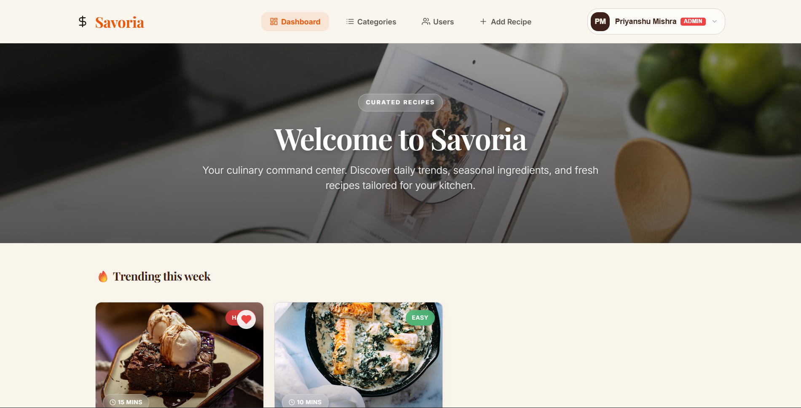
  
  # 🍳 Savoria Recipe App
  
  **A robust, modern Full-Stack Recipe Web Application built with the MEAN Stack.**
  
  [](https://angular.io/)
  [](https://nodejs.org/)
  [](https://expressjs.com/)
  [
  ](https://mongodb.com/)
</div>

---

**🔗 Live App**: [savoria-p.vercel.app](https://savoria-p.vercel.app)  
**🔗 Live API**: [savoria-xmme.onrender.com](https://savoria-xmme.onrender.com)

Savoria focuses on strict REST API design, robust database schemas, secure authentication, role-based access control, and a lightning-fast reactive Angular 17+ standalone frontend.

## 🔑 Demo Logins

| Role | Email | Password |
| :--- | :--- | :--- |
| **Admin** | admin@savoria.com | admin123 |
| **User** | chef@savoria.com | password123 |

## ✨ Features

- 🔐 **Secure Authentication**: JWT-based auth with encrypted passwords and 401 handling.
- 🧑‍🍳 **Role-Based Access Control**: Admins can moderate recipes and users.
- 🛒 **Dynamic Checkout**: Mock checkout flow for ingredients with dynamic cart calculations.
- 🔍 **Advanced Search**: Compound text indexes for incredibly fast title, tag, and ingredient searching.
- 📱 **Fully Responsive**: Carefully crafted mobile, tablet, and desktop layouts.
- 🔔 **Real-time Notifications**: Socket.IO push notifications for reviews, saves, replies, and helpful votes, featuring smart unread grouping, filtering, image thumbnails, and customizable user settings.
- 📅 **Meal Planner & Smart Shopping List**: Weekly interactive grid to schedule meals, automatically aggregating ingredients into a smart printable checklist with brand-styled PDF exporting.

---

## 📂 Folder Structure

The project follows a strict monorepo architecture, separating the Angular frontend and Node.js backend.

### Frontend (`client/`)
```text
client/
├── src/
│   ├── app/
│   │   ├── core/           # Guards, Interceptors, Models, and API Services
│   │   ├── features/       # Smart components (Dashboard, Login, RecipeDetail, etc.)
│   │   ├── shared/         # Reusable UI components & pipes (Navbar, Footer, RecipeCard)
│   │   ├── app.routes.ts   # Application routing configuration
│   │   └── app.ts          # Root component
│   └── environments/       # Environment variables (API URLs)
```

### Backend (`server/`)
```text
server/
├── src/
│   ├── config/             # Environment & App configuration
│   ├── controllers/        # Business logic for routes
│   ├── middleware/         # Custom middleware (JWT protect, Admin role checking)
│   ├── models/             # Mongoose database schemas (User, Recipe, Notification)
│   ├── routes/             # Express router definitions
│   ├── scripts/            # Database seeding scripts
│   ├── socket/             # Socket.IO handlers for real-time pushing
│   ├── tests/              # Jest integration test suites
│   ├── utils/              # Reusable backend utilities (e.g., Notification Grouping)
│   ├── validators/         # Express-validator rule chains
│   └── server.ts           # App entry point & express configuration
```

---

## 📸 Screenshots

| Dashboard | Categories |
| :---: | :---: |
| 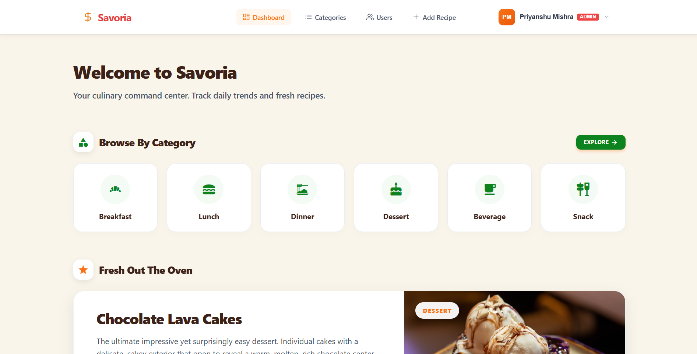 | 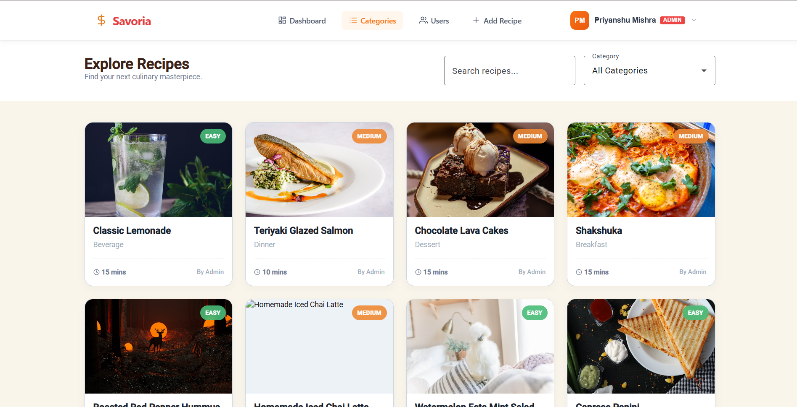 |

| Recipe View | Cooking Mode |
| :---: | :---: |
|  |  |

| Payment Checkout | Add Recipe |
| :---: | :---: |
| 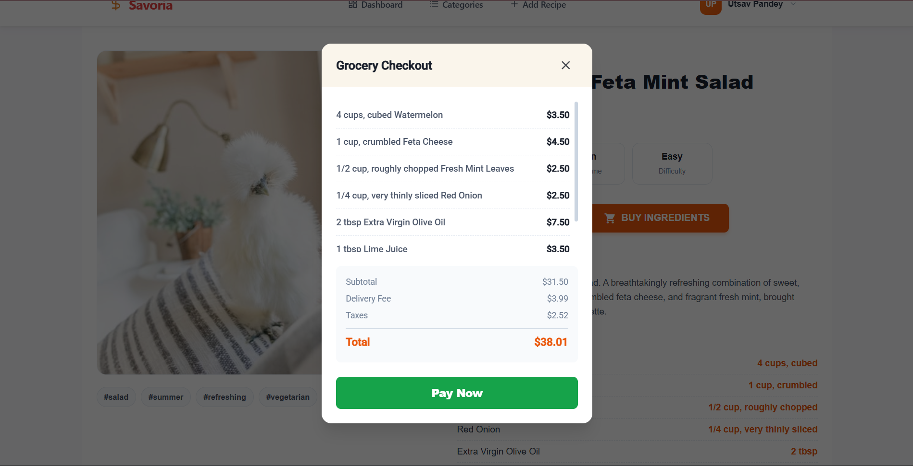 |  |

| My Recipes | Admin Panel |
| :---: | :---: |
|  | 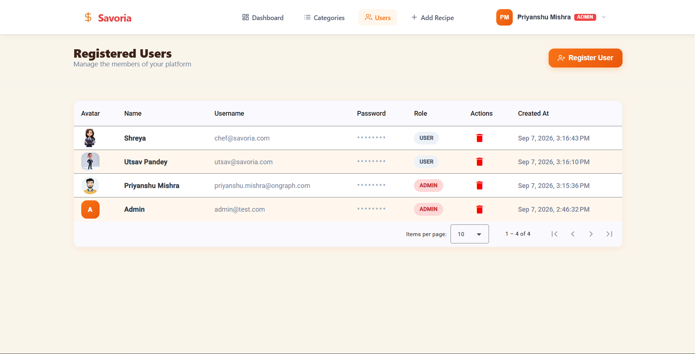 |

| Recipe Scroll | Admin Recipes |
| :---: | :---: |
|  |  |

---

## 📅 Development Progress

### ✅ Day 1: Setup & Data Layer (Completed)
- **Monorepo Architecture**: Clean separation of `client/` (Angular) and `server/` (Node.js/Express) within a single repository.
- **Database Connection**: Configured MongoDB Atlas connection using Mongoose, featuring graceful shutdown hooks (`SIGINT`, `SIGTERM`).
- **Robust Data Modeling**:
  - **User Schema**: Includes `name`, `email`, password hashing (via `bcrypt` pre-save hook), `role` (user/admin), and automatic password omission in JSON responses.
  - **Recipe Schema**: Includes ownership references, validation rules, descriptions, imagery, difficulty, tags, and a likes system.
  - **Search Optimization**: Implemented compound text indexes on recipe titles, ingredients, descriptions, and tags for powerful search queries.

### ✅ Day 2: Authentication (Completed)
- **Authentication Endpoints**: Implemented robust `/api/auth/register` and `/api/auth/login` routes.
- **Security & Hashing**: Verified user credentials securely using `bcrypt` comparison.
- **JWT Implementation**: 
  - Signed JSON Web Tokens upon successful login with a 7-day expiry.
  - Built custom `protect` middleware to intercept requests and verify JWT integrity.
  - Strictly enforcing `401 Unauthorized` for missing, bad, or expired tokens.
- **Session Management**: Implemented `GET /api/auth/me` to safely retrieve the current logged-in user profile from the token payload.

### ✅ Day 3: CRUD, Validation & Authorization (Completed)
- **RESTful Recipe API**: Implemented full CRUD (`GET`, `POST`, `PUT`, `DELETE`) endpoints for recipes.
- **Strict Input Validation**: Utilized `express-validator` to enforce rules on every input field before processing requests.
- **Role-Based Authorization**:
  - Ensured only the original `owner` of a recipe can edit or delete it.
  - Implemented an `admin` role override for global moderation.
- **Status Code Discipline**: Explicit separation between `401 Unauthorized` (auth failure) and `403 Forbidden` (permission failure).
- **Global Error Handling**: Centralized error middleware to catch and format API errors and `404 Not Found` routes consistently.

### ✅ Day 4: API Hardening & Tests (Completed)
- **Advanced Querying**: Implemented pagination, category filtering, and full-text search directly via API query parameters.
- **API Hardening**: 
  - Secured HTTP headers using `helmet`.
  - Configured strict environment-based `CORS` origins.
  - Implemented global endpoint rate-limiting using `express-rate-limit` to prevent abuse.
- **Automated Testing**: Built an integration test suite using `Jest` and `Supertest` covering request validation, authentication tokens, and deep RBAC permission checks.
- **Data Seeding**: Created an automated database seed script for generating test users, admins, and sample recipes.

### ✅ Day 5: Frontend Dashboard & Data Integration (Completed)
- **Standalone Architecture**: Configured Angular routing and feature modules using modern standalone components.
- **Dashboard UI**: Designed the main dashboard layout, featuring dynamic "Fresh Out The Oven" and "Browse by Category" sections.
- **Data Binding**: Integrated backend API endpoints to fetch and display live recipe statistics, categories, and author details.
- **Data Mapping Fixes**: Resolved schema mapping issues between the backend and frontend to accurately calculate and display total cooking/prep times and handle default image fallbacks.

### ✅ Day 6: Responsive Design & Admin Features (Completed)
- **Responsive Navigation**: Implemented a mobile-friendly navbar with a fully functional hamburger menu and tablet-optimized avatars.
- **Admin Users Page**: Revamped the "Registered Users" admin interface to handle varied screen sizes, utilizing horizontally scrollable tables on tablets and stacked headers on mobile.
- **Mobile Grid Layouts**: Refined the "Explore Recipes" page to automatically switch to a sleek single-column grid on small screens, optimizing filter spacing and removing unnecessary padding.
- **UI Standardization**: Adjusted core UI elements like form buttons, border radii, and primary orange gradient actions (`#f97316`) for a highly polished and consistent user experience across devices.

### ✅ Day 7: Bug Fixes, Checkout & Deployment Readiness (Completed)
- **Auth & Routing Fixes**: Resolved critical bugs in the `auth.interceptor.ts` (preventing global logouts on failed logins) and fixed the user registration route that was accidentally locked behind admin middleware.
- **Recipe Link Navigation**: Corrected a regex issue in the URL slug generator that was stripping hyphens and causing 404s, and implemented automatic scroll-to-top logic when navigating between related recipes.
- **Mock Checkout Flow**: Added a "Buy Ingredients" button that launches a beautifully styled, dynamic cart modal which calculates subtotals, delivery fees, and taxes based on the specific recipe's ingredients.
- **Test Suite Enhancements**: Updated backend tests to securely execute against a dedicated `Savoria-Test` database, completely preventing accidental production data deletion during test teardowns.
- **Deployment Configuration**: Added a `start` script for Render compatibility and updated the frontend `set-env.js` file to seamlessly integrate with Vercel's standard environment variables (`process.env.API_URL`).

### ✅ Day 8: Advanced Image Uploads (Completed)
- **Dynamic File Routing**: Implemented dynamic Multer storage configurations to route uploaded images into separate `uploads/avatars/` and `uploads/recipes/` directories.
- **Contextual Filenames**: Engineered a solution to pass frontend form context (like recipe titles or user names) into the `FormData` object, allowing the backend to generate descriptive, human-readable filenames (e.g., `<timestamp>-creamy-garlic-pasta.jpg`).
- **Database Persistence**: Updated schemas and controllers to securely store and retrieve relative image paths, ensuring seamless display across the application.
- **State Management & UI Fixes**: Resolved Angular `NG0100` lifecycle errors during upload flows and implemented a polished, delayed success modal when publishing recipes.


# Daily Log of Advanced Sprint

### ✅ Day 9: AI Ratings & Reviews (Completed)
- **AI Sentiment Analysis**: Integrated `@xenova/transformers` directly in the browser via an Angular Web Worker to perform sentiment and toxicity analysis on user reviews without blocking the main UI thread.
- **Robust Aggregation**: Engineered MongoDB `$facet` aggregation pipelines to automatically recalculate and synchronize a recipe's `averageRating`, `reviewCount`, and 5-star distribution whenever a review is posted or deleted.
- **Interactive Review UI**: Built a standalone `review-section.component.ts` featuring helpful voting, author replies, dynamic sorting, and a custom deletion confirmation modal.
- **Recipe Card Enhancements**: Overhauled the frontend layout to cleanly display inline star ratings directly beside recipe titles across all dashboard carousels and search lists.
- **Review API Testing**: Expanded the Jest integration suite to specifically test the Ratings & Reviews flow, verifying full data integrity and strict authorization checks (ensuring 32/32 tests pass).

---

## 🤖 In-Browser AI Add-ons for Day 9
This project fulfills the requirement free AI add-ons running entirely in the browser using Web Workers (displaying a non-blocking loading state).

1. **Sentiment Analysis** 
   - **Model**: `Xenova/distilbert-base-uncased-finetuned-sst-2-english` (via Transformers.js).
   - **What it does**: Analyzes the text of user reviews before submission to determine if the tone is POSITIVE or NEGATIVE, automatically attaching a colored sentiment badge to the review.
2. **Toxicity Detection**
   - **Model**: `@tensorflow-models/toxicity` (via TensorFlow.js).
   - **What it does**: Scans review comments for insults, profanity, and toxic language. It calculates the probability of toxicity and attaches the metadata to keep the community safe.

*(Both models dynamically download and initialize asynchronously in the background. The UI displays a clear "AI engines warming up..." loading state inside the review box until they are ready to process data).*

## 📸 Screenshots of Day 9

| Reviews & Ratings | Ratings |
| :---: | :---: |
| 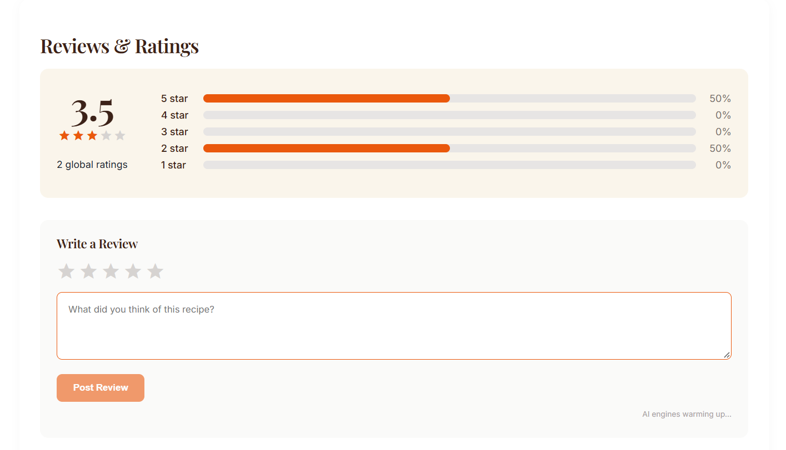 | 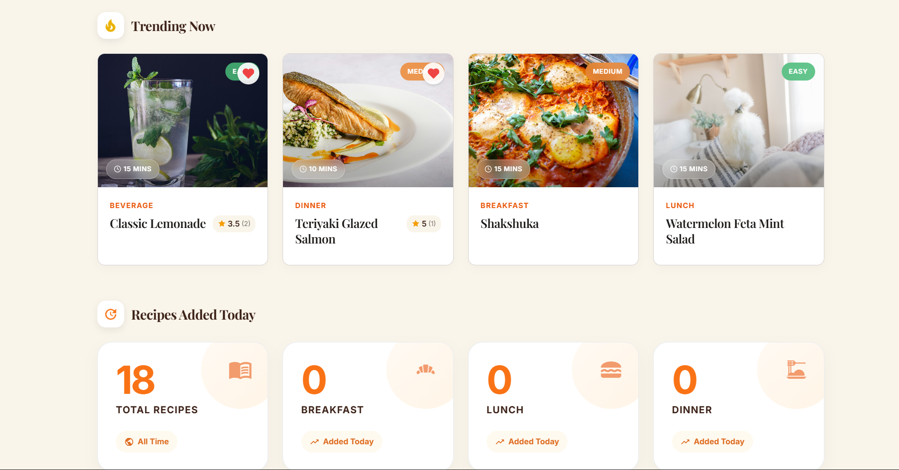 |

| AI Sentiment & Toxicity | |
| :---: | :---: |
| 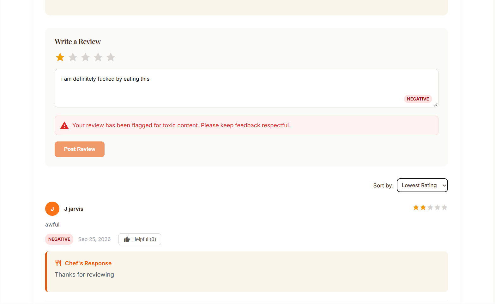 | |

---

### ✅ Day 10: Favorites and Collections (Completed)

- **My Cookbooks Dashboard**: Added the "My Cookbooks" page with built-in pagination for seamlessly managing your saved bookmarks and favorited recipe cards.
- **MobileNet Image Warning**: Integrated TensorFlow.js MobileNet directly into the recipe upload form to classify images locally, showing a warning banner if the uploaded image is not food.
- **Favorites Integration**: Upgraded the backend favorites logic and wired it up to a 1-click "Heart" button on recipe cards, with animated Toast notifications.
- **Auto-Cookbooks**: Favoriting a recipe automatically provisions and syncs a custom "Favorites" Cookbook on the collections dashboard for seamless organization.
- **Privacy & CSS Fixes**: Scrubbed user emails from MongoDB populated collaborator lists to prevent PII leaks, and fixed complex mobile CSS layout bugs on the navbar.
- **Favourite API Testing**: Expanded the Jest integration suite to specifically test the favourite and collections flow, verifying full data integrity and strict authorization checks (ensuring 42/42 tests pass).

## 🤖 In-Browser AI Add-ons for Day 10
1. **Image Content Warning**
   - **Model**: `@tensorflow-models/mobilenet` (via TensorFlow.js).
   - **What it does**: Analyzes recipe image uploads directly in the browser to ensure the image contains food. If the image is not food-related, a warning banner alerts the user before uploading.

## 📸 Screenshots of Day 10

| My Cookbook | Favorites Collections |
| :---: | :---: |
|  | 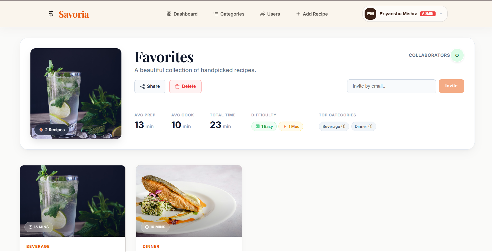 |

| Collection Popup | AI Warning |
| :---: | :---: |
|  |  |

---

### 🟢 Day 11: Search, Semantic AI & UI Polish (Completed)

- **Robust Backend API**: Upgraded the MongoDB backend with weighted text search (prioritizing titles and tags) and strict $all array matching for ingredients.
- **Centralized RxJS State Management**: Refactored the frontend SearchService to use a centralized BehaviorSubject and switchMap RxJS pipeline, eliminating duplicate API calls on fast typing.
- **"Cook with what I have"**: Built a rich filtering UI with an interactive ingredient chip picker, cook time slider, and sort bars.
- **Smart Trending & Similar Sections**: Added a "Trending" horizontal scroll bar and a Smart "Similar Recipes as Recommended for You" section that offloads AI Semantic Re-ranking to a Web Worker.
- **Hands-free Voice Search**: Integrated the Web Speech API for hands-free voice searching directly inside the search bar.
- **API Testing**: Expanded the Jest integration suite to specifically test advanced query filtering, verifying full data integrity (ensuring 47/47 tests pass).

## 🧠 In-Browser AI Add-ons for Day 11
1. **Semantic "Similar Recipes" Re-ranking**
   - **Model**: Xenova/all-MiniLM-L6-v2 (via Transformers.js).
   - **What it does**: Offloads heavy feature extraction and cosine similarity math to a background Web Worker. It compares the current recipe's text (title & ingredients) against candidate recipes to re-order the "You might also like" recommendations locally based on semantic meaning!

2. **Hands-free Voice Search**
   - **Model**: Built-in Browser AI (via Web Speech API).
   - **What it does**: Captures microphone input locally and uses the browser\'s native speech recognition engine to instantly transcribe spoken words into text queries directly inside the search bar.

## 📸 Screenshots of Day 11

| Search Section | Filtering Section |
| :---: | :---: |
| 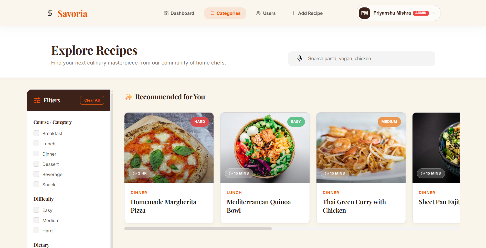 | 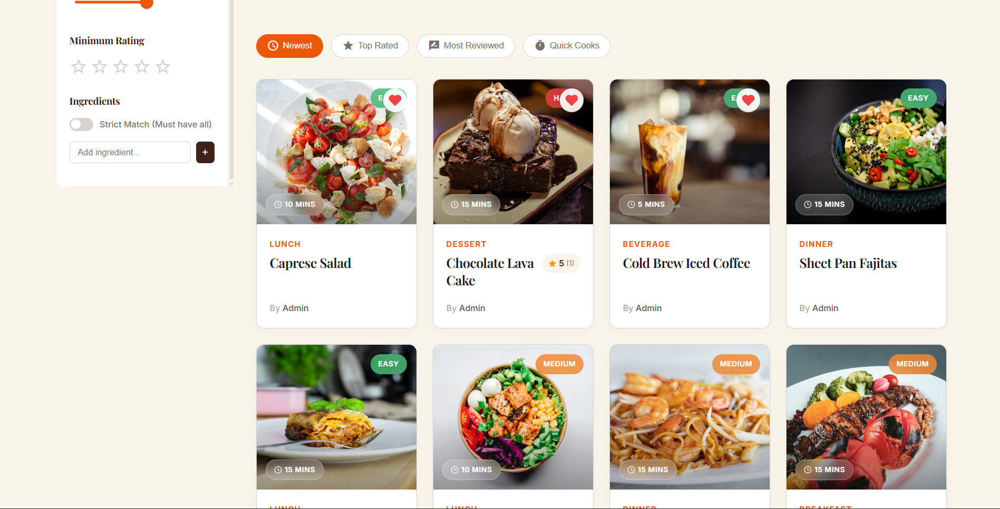 |

| Trending this Week | |
| :---: | :---: |
| 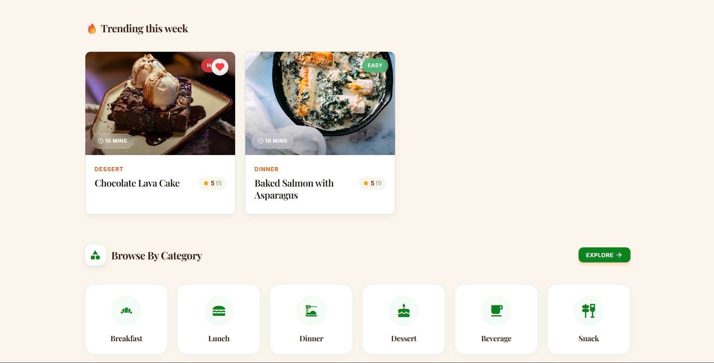 | |

---

### 🟢 Day 12: Real-time Notifications & Settings (Completed)

- **Real-time Push Notifications**: Integrated Socket.IO for real-time pushing and MongoDB for persistent notification storage across 4 events (Reviews, Saves, Replies, and Helpful Votes).
- **Anti-Spam Grouping**: Engineered a "Notification Grouping" backend utility that prevents spam by grouping unread notifications for the same recipe (e.g., "John Doe and 4 others saved your recipe").
- **Robust Dropdown UI**: Created a highly polished frontend UI dropdown with Unread/All tabs, recipe image thumbnails, "Mark all read" capabilities, inline delete buttons, and cursor-based infinite scroll pagination.
- **Customizable Preferences**: Built a Settings page allowing users to strictly opt-out of specific notification types, properly synced to their MongoDB profile.
- **E2E Testing**: Expanded the Jest integration suite in `api.test.ts` to strictly verify the full notification creation, pagination, unread counts, reading, and deletion lifecycle (ensuring 53/53 tests pass).

## 📸 Screenshots of Day 12

| Notification Dropdown | Settings Preferences |
| :---: | :---: |
| 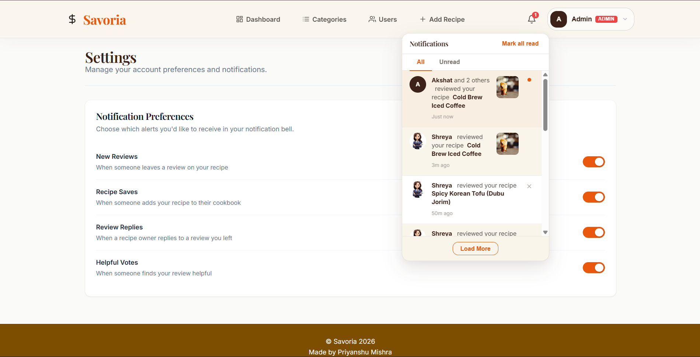 | 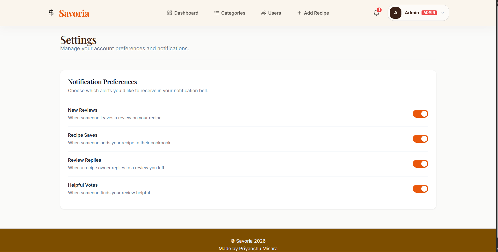 |

---

### 🚀 Day 13: Meal Planner & Smart Shopping List (Completed)

- **Weekly Meal Planner**: Built an interactive grid allowing users to schedule meals (Breakfast, Lunch, Dinner, Snacks and etc) using an Angular Material interface.
- **Smart Shopping List**: Engineered an automated list that aggregates all ingredients from scheduled recipes, intelligently extracting numbers and units (e.g. '1 (15 oz) can', '1-2 lbs') and merging identical items.
- **Brand UI Overhaul**: Applied a comprehensive Savoria-branded design to the planner, utilizing warm gradients, custom active tab indicators, and aesthetic grid borders.
- **Print-Ready PDF Export**: Created a pristine PDF print view that hides browser headers, forces brand color printing, and injects precise top/bottom page margins using HTML spacers.


## 🤖 In-Browser AI Add-ons for Day 13
1. **Intelligent Ingredient Parser**
   - **Model**: Advanced Parsing Heuristics (Zero-dependency).
   - **What it does**: Processes messy, human-written ingredient strings (e.g., '1 (15 oz) can', '1-2 lbs') to automatically extract precise numerical quantities and normalized unit metrics in the browser, preventing zero-value math errors in the generated shopping list.

2. **Hands-free Cook Mode**
   - **Model**: Native Browser AI (window.speechSynthesis).
   - **What it does**: Provides a hands-free cooking experience by leveraging the browser's built-in text-to-speech engine to read recipe steps aloud, allowing users to cook without constantly checking their screen.

## 📸 Screenshots of Day 13

| Weekly Meal Planner | Smart Shopping List |
| :---: | :---: |
| 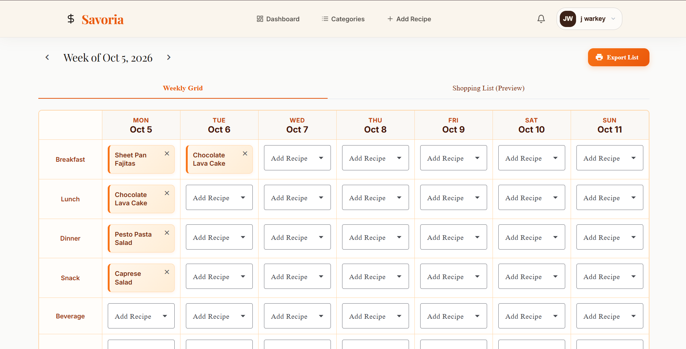 | 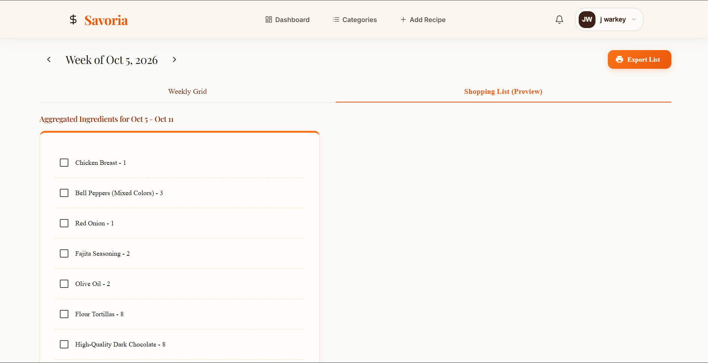 |

| PDF Export View |
| :---: |
| 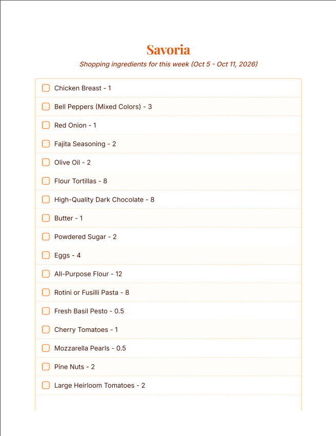 |

---

### 🚀 Day 14: Snap & Cook (AI Recipe OCR) & CI/CD Pipeline

- **Snap & Cook (AI Scanner)**: Implemented an entirely in-browser OCR scanner using `Tesseract.js` WebAssembly. Users can snap a photo of a physical recipe card or cookbook page, and the AI instantly transcribes and auto-fills the Angular reactive recipe form.
- **Automated Text Parsing**: Engineered a smart heuristic parser that scans raw OCR text to intelligently differentiate between Titles, Ingredients (detecting measurements), and Cooking Steps.
- **GitHub Actions CI Pipeline**: Built an automated continuous integration pipeline (`.github/workflows/ci.yml`) that validates the build, runs the headless Angular frontend tests, and spins up an in-memory MongoDB container to execute all 53 backend API tests via Jest & Supertest upon every push.
- **Real Angular Unit Tests**: Replaced scaffolded Jasmine specs with fully functional `TestBed` unit tests for the Meal Planner feature, mocking services, testing component interactions, and ensuring robust lookup mapping.

## 🤖 In-Browser AI Add-ons for Day 14
1. **Snap & Cook Optical Character Recognition (OCR)**
   - **Model**: `Tesseract.js` (WebAssembly-based eng.traineddata).
   - **What it does**: Runs a highly accurate machine learning OCR model entirely locally inside the user's browser, respecting privacy while perfectly translating photos of text into digital recipes without calling external paid APIs.


## 🔐 Authentication & Authorization Walkthrough

Savoria implements strict **Role-Based Access Control (RBAC)** to ensure users can only modify their own data. This is proven and enforced by both the UI and the automated test suite.

**1. Creating a Recipe (Authenticated User)**
When a logged-in user creates a recipe, the backend automatically attaches their unique `User ID` to the recipe's `owner` field via the JWT payload.

**2. Editing/Deleting (Owner)**
If the original author clicks "Edit" or "Delete", the backend verifies that `recipe.owner === req.user.id`. Since they match, the action is permitted (`200 OK`).

**3. The 403 Forbidden Guard (Different User)**
If User B attempts to send a `PUT` or `DELETE` request to User A's recipe, the backend intercepts it:
```typescript
if (recipe.owner.toString() !== req.user.id && req.user.role !== 'admin') {
  return res.status(403).json({ message: 'Forbidden' });
}
```
The server immediately rejects the request with a `403 Forbidden` status. The frontend intercepts this error and displays an access denied message without crashing.

**4. The Admin Override**
If an `admin` attempts to delete User A's recipe, the same block of code sees `req.user.role === 'admin'` and allows the deletion to proceed.

*Note: All 53 scenarios are fully covered by the automated integration tests (`npm run test` in the server), including registration, JWT auth, RBAC, pagination, AI routes, real-time notifications, and admin operations.*

---

## 🚀 Getting Started

### ⚙️ Environment Variables

Create a `.env` file in the `server/` directory (you can use `server/.env.example` as a template):

| Variable | Description | Example |
| :--- | :--- | :--- |
| `MONGODB_URI` | Your MongoDB connection string | `mongodb+srv://...` |
| `JWT_SECRET` | Secret key used to sign JWTs | `super_secret_key` |
| `CLIENT_URL` | The URL of the frontend (for CORS) | `http://localhost:4200` |
| `API_URL` | *(Optional)* Override API url for client | `http://localhost:3000/api` |

### Prerequisites
- Node.js (v20+)
- Angular CLI (`npm i -g @angular/cli`)
- MongoDB Atlas URI

### Running the Server
```bash
cd server
npm install
cp .env.example .env  # Update with your details
npm run dev
```

### Running the Client
```bash
cd client
npm install
cp .env.example .env  # Optional: Customize API URL if needed
npm start
```

---

## 🗺️ App Walkthrough

| Step | What to do |
| :--- | :--- |
| **1. Browse** | Open the app → Dashboard shows latest recipes and category tiles |
| **2. Explore** | Click **Explore Recipes** → search by keyword, filter by category, paginate |
| **3. Detail** | Click any recipe card → full ingredients, steps, cooking mode, and ingredient checkout |
| **4. Sign Up** | Go to `/register` → fill in name, email, password, optional avatar |
| **5. Log In** | Use your new credentials or the demo logins above |
| **6. Create** | Click **+** or **Add Recipe** → fill the form with image upload |
| **7. Edit/Delete** | Open your own recipe → Edit or Delete buttons appear only for owners |
| **8. Admin** | Log in as admin → access Users panel to deactivate/reactivate accounts |


